# Paybot - Robot Control with X402 Micropayments

> **EthGlobal Submission** - Component-driven React web app with blockchain-based micropayments for robot control

A full-stack application that enables pay-per-use access to robotic systems using the X402 micropayment protocol with gasless transactions, built with React, Hardhat 3, and Bun.

---

## 🎯 X402 Payment Flow with Facilitator

### Complete Payment Lifecycle


### System Architecture

```mermaid
graph TB
    subgraph "👤 User Layer"
        User[User]
        Wallet[MetaMask/WalletConnect<br/>Wallet Provider]
    end

    subgraph "🌐 Frontend Layer - Port 5173"
        Web[Web App<br/>React + Vite + Tailwind]
        Components[UI Components<br/>BotAccessGate, PaymentModal]
        Stories[Storybook<br/>Component Library]
    end

    subgraph "🔧 Backend Layer"
        Resource[Resource Server :8404<br/>Protected Endpoints]
        Facilitator[X402 Facilitator :8403<br/>/verify, /settle]
        X402Lib[X402 Library<br/>Signatures & Validation]
    end

    subgraph "⛓️ Blockchain Layer - Port 8545"
        Hardhat[Hardhat Node<br/>Local Ethereum]
        QUSD[QUSD Token<br/>ERC20 + EIP-2612]
        Escrow[Escrow Contract<br/>Gasless Payments]
        Verifier[PaymentVerifier<br/>Signature Validation]
    end

    subgraph "🤖 External Hardware"
        Robot[UGV Rover<br/>Physical Robot]
    end

    User -->|1. Request Access| Web
    Web -->|2. Request Signatures| Wallet
    Wallet -->|3. Signed Payloads| Web
    Web -->|4. X-PAYMENT Header| Resource
    Resource -->|5. Verify| Facilitator
    Facilitator -->|Uses| X402Lib
    Resource -->|6. Settle| Facilitator
    Facilitator -->|7. Submit TX| Hardhat
    Hardhat --> QUSD
    Hardhat --> Escrow
    Escrow --> Verifier
    Resource -->|8. Control Commands| Robot
    Robot -->|Video Stream| Web

    style User fill:#8b5cf6,color:#fff
    style Wallet fill:#a855f7,color:#fff
    style Web fill:#3b82f6,color:#fff
    style Resource fill:#10b981,color:#fff
    style Facilitator fill:#059669,color:#fff
    style Hardhat fill:#f59e0b,color:#fff
    style QUSD fill:#ef4444,color:#fff
    style Escrow fill:#dc2626,color:#fff
    style Robot fill:#6366f1,color:#fff
```



### Docker Service Dependencies


---

## 🚀 Quick Start

### Prerequisites

- **Bun** ≥ 1.0 - [Install Bun](https://bun.sh)
- **Docker & Docker Compose** - For running blockchain and services
- **Node.js** ≥ 20.0 (for Hardhat compatibility)

### Setup & Run

1. **Clone and setup environment:**
   ```bash
   git clone <your-repo-url>
   cd paybot
   cp .env.example .env
   # Edit .env if needed (defaults work for local development)
   ```

2. **Install dependencies:**
   ```bash
   bun install
   ```

3. **Start all services with Docker:**
   ```bash
   docker-compose up -d
   ```

   This starts:
   - **Hardhat blockchain node** (port 8545) - Local Ethereum network
   - **X402 facilitator** (port 8403) - Payment verification & settlement
   - **Resource server** (port 8404) - Robot control API
   - **Web frontend** (port 5173) - React application

4. **Access the application:**
   - **Web App:** http://localhost:5173
   - **Storybook:** `cd apps/web && bun run storybook`

5. **Deploy contracts (if needed):**
   ```bash
   cd packages/contracts
   bun run deploy:local
   ```

---

## 📊 Payment Protocol Details

### X402 Payment Payload Structure


### Payment States & Transitions


---

## 📁 Project Structure


This is a **Turborepo monorepo** managed with **Bun workspaces**:

```
paybot/
├── .env.example              # Single source of truth for configuration
├── docker-compose.yml        # Multi-container orchestration
├── turbo.json                # Build pipeline configuration
├── apps/
│   ├── web/                  # React frontend (Vite + Tailwind + Storybook)
│   │   ├── src/
│   │   │   ├── components/   # UI components (gate, payment, basic, specialized, robot)
│   │   │   └── config/       # Environment-driven configuration
│   │   └── stories/          # Storybook stories for all components
│   └── x402-facilitator/     # Payment facilitator service
│       └── src/
│           ├── facilitator.ts    # Core payment verification & settlement
│           ├── server.ts         # HTTP endpoints (/verify, /settle)
│           └── example-resource-server.ts
└── packages/
    ├── contracts/            # Hardhat 3 smart contracts
    │   ├── contracts/        # QUSD token, Escrow, PaymentVerifier
    │   └── test/             # Comprehensive test suite (69 tests)
    ├── x402/                 # X402 TypeScript library
    │   └── src/              # Protocol utilities, signatures, middleware, client helpers
    └── tsconfig/             # Shared TypeScript configurations
```

---

## 🎨 Component Architecture


### Component Storybook Library

All components are documented in Storybook with interactive examples:

- **Gate Components:** BotAccessGate with various states
- **Payment Components:** PaymentModal, PaymentStatusCard
- **Robot Components:** FullScreenRobotView, RobotControlSidebar, Webcam
- **Basic Components:** Button, Card, Input, Header
- **Specialized Components:** CountdownTimer

Run Storybook: `cd apps/web && bun run storybook`

---

## ⚙️ Environment Configuration

### Configuration Flow


### Key Environment Variables

All configuration is centralized in `.env.example`:

```bash
# Blockchain
ANVIL_PORT=8545
ANVIL_CHAIN_ID=31337

# Contracts (deterministic addresses from Hardhat)
QUSD_TOKEN_ADDRESS=0x5FbDB2315678afecb367f032d93F642f64180aa3
ESCROW_CONTRACT_ADDRESS=0xe7f1725E7734CE288F8367e1Bb143E90bb3F0512

# X402 Services
X402_FACILITATOR_PORT=8403
X402_RESOURCE_PORT=8404

# Frontend (VITE_ prefix required for browser access)
VITE_CHAIN_ID=31337
VITE_RPC_URL=http://localhost:8545
VITE_QUSD_TOKEN_ADDRESS=0x5FbDB2315678afecb367f032d93F642f64180aa3
VITE_ESCROW_CONTRACT_ADDRESS=0xe7f1725E7734CE288F8367e1Bb143E90bb3F0512

# Robot Configuration
VITE_ROBOT_CONTROL_URL=http://192.168.0.221:5000
VITE_BOT_ID=ugv-rover-01
VITE_BOT_NAME=UGV Rover
```

**Configuration Principles:**
1. **Single Source of Truth:** All configuration in `.env.example`
2. **VITE_ Prefix:** Browser variables need `VITE_` prefix
3. **No Hardcoding:** All addresses/URLs from environment
4. **Docker Integration:** Services read from `.env` automatically
5. **Type Safety:** Config modules export typed constants

See `.env.example` for complete documentation.

---

## 🛠️ Development Workflow

### Monorepo Commands

```bash
# Run all dev servers
bun run dev

# Build all packages
bun run build

# Run all tests
bun run test

# Run E2E tests (headless)
bun run test:e2e

# Run E2E tests (keep services running for debugging)
bun run test:e2e:dev

# Clean all build artifacts
bun run clean

# Format code
bun run format
```

### Package-Specific Development

```bash
# Smart contracts (Hardhat 3)
cd packages/contracts
bun run compile        # Compile contracts with viaIR optimizer
bun run test          # Run 69 tests (all passing)
bunx hardhat node     # Start local blockchain node

# X402 Protocol Library
cd packages/x402
bun run build         # Build TypeScript library
bun run typecheck     # Validate types

# Frontend
cd apps/web
bun run dev           # Development server (port 5173)
bun run storybook     # Component library (port 6007)
bun run build         # Production build

# X402 Facilitator
cd apps/x402-facilitator
bun run start         # Start facilitator (port 8403)
bun run start:resource # Start resource server (port 8404)
```

---

## 🧪 Testing

### E2E Testing Flow


### Running Tests

**Unit Tests:**
```bash
# Run all unit tests
bun run test

# Run contract tests only
cd packages/contracts
bun run test
```

**E2E Tests (Headless):**

The E2E test suite runs a complete end-to-end test of the entire stack:

```bash
# Run full E2E test (auto cleanup)
bun run test:e2e

# Run E2E test and keep services running
bun run test:e2e:dev
```

**What it tests:**
- ✅ Docker Compose service orchestration
- ✅ Hardhat blockchain node RPC
- ✅ X402 facilitator health and endpoints
- ✅ Resource server health and endpoints
- ✅ Web application availability
- ✅ Smart contract compilation and tests (69 tests)
- ✅ Service health checks and dependencies

**Manual Testing:**
```bash
# Start all services
docker-compose up -d

# Check service health
docker-compose ps

# View logs
docker-compose logs -f [service-name]

# Stop all services
docker-compose down
```

---

## 📦 Technology Stack

- **Frontend:** React 18, Vite 5, TypeScript 5
- **Styling:** Tailwind CSS 3, shadcn/ui components
- **Blockchain:** Hardhat 3, viem 2, wagmi 2
- **Smart Contracts:** Solidity 0.8.28 with viaIR optimizer
- **Components:** Storybook 8 for isolated development
- **Monorepo:** Turborepo 2, Bun workspaces
- **Infrastructure:** Docker Compose
- **Payment Protocol:** X402 with EIP-2612 & EIP-712

---

## 🏗️ Implementation Status

### ✅ Completed (MVP Ready)

**Foundation (M1)**
- [x] Monorepo setup with Turborepo and Bun
- [x] Environment variable system
- [x] Shared TypeScript configurations

**Smart Contracts (M2)**
- [x] QUSD ERC20 token with EIP-2612 permits
- [x] Escrow contract with gasless payments
- [x] PaymentVerifier for signature validation
- [x] 69 passing tests with full coverage

**X402 Protocol (M3)**
- [x] Protocol utilities (encoding, validation, 402 responses)
- [x] Signature helpers (EIP-712, EIP-2612)
- [x] HTTP middleware for payment verification
- [x] Client helpers for payment creation
- [x] Integration tests

**Backend Services (M4)**
- [x] X402 facilitator with /verify and /settle endpoints
- [x] Example resource server with X402 middleware
- [x] Docker Compose orchestration
- [x] Gasless payment settlement

**Frontend & Components (M5)**
- [x] Vite React app with Tailwind CSS
- [x] Wagmi v2 wallet integration
- [x] Configuration layer (environment-driven)
- [x] Payment components (PaymentModal, PaymentStatusCard)
- [x] Access gate component (BotAccessGate)
- [x] Basic components (Button, Card, Input, Header)
- [x] Specialized components (CountdownTimer, Webcam)
- [x] Robot components (FullScreenRobotView, RobotControlSidebar)
- [x] Comprehensive Storybook library (30+ stories)

**Infrastructure (M6)**
- [x] Vite configuration with proxies
- [x] Docker Compose with 4 services
- [x] Health checks and service dependencies
- [x] E2E test suite with headless testing

**Documentation (M7)**
- [x] Comprehensive Mermaid architecture diagrams
- [x] Payment flow documentation
- [x] Component hierarchy visualization
- [x] Environment configuration guide

---

## 🔒 Security Considerations

⚠️ **Important:**
- Never commit `.env` file
- Rotate private keys in production
- Use hardware wallet for contract deployment
- Audit contracts before mainnet deployment
- Validate all user inputs
- Implement rate limiting on X402 servers
- Verify EIP-712 and EIP-2612 signatures properly
- Monitor facilitator wallet balance for gas fees

---

## 📚 Documentation

- [GitHub Issues](../../issues) - Implementation tracking
- [Environment Variables](.env.example) - Complete configuration reference
- [Smart Contracts](packages/contracts/) - Solidity contracts and tests
- [X402 Protocol](packages/x402/) - TypeScript library
- [Storybook](http://localhost:6007) - Component library (run `bun run storybook`)

---

## 🤝 Contributing

1. Fork the repository
2. Create feature branch (`git checkout -b feature/amazing-feature`)
3. Make changes and test thoroughly
4. Update Storybook stories if adding/modifying components
5. Commit changes (`git commit -m 'Add amazing feature'`)
6. Push to branch (`git push origin feature/amazing-feature`)
7. Open Pull Request

---

## 📄 License

[Your License Here]

---

## 🙏 Acknowledgments

- Built for **EthGlobal Hackathon**
- X402 micropayment protocol
- shadcn/ui component library
- Hardhat development framework
- EIP-2612 (Permit) and EIP-712 (Typed Structured Data) standards

---

**Status:** ✅ MVP Complete | **Components:** 11 | **Tests:** 69 passing | **Services:** 4 running | **Gasless:** ⛽ Zero gas for users
